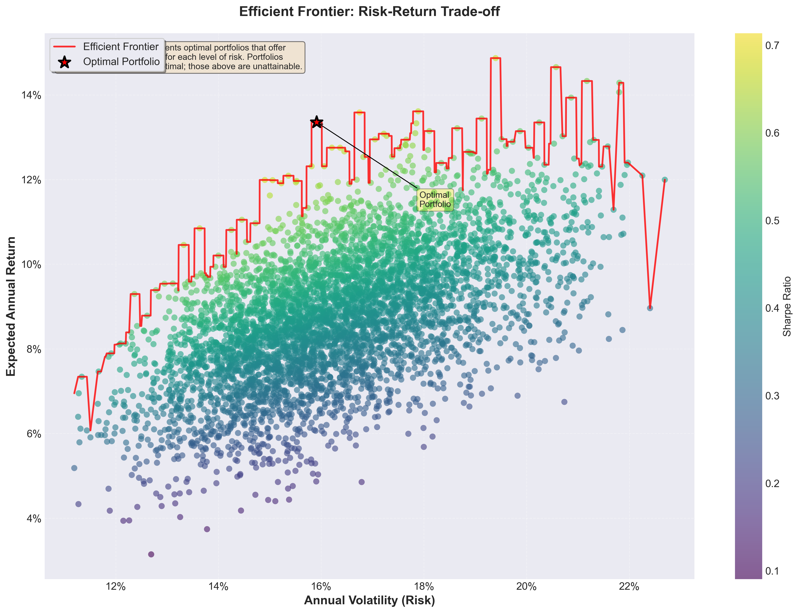
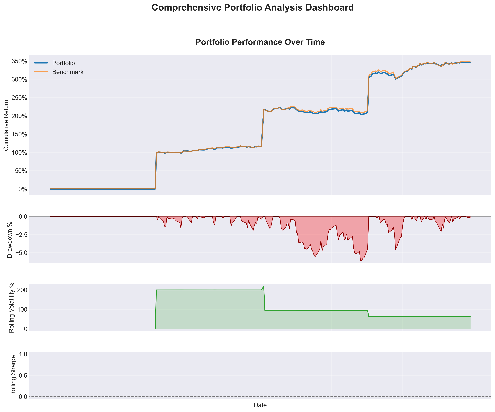

# Portfolio Optimization Pro 🚀

A production-grade portfolio optimization framework implementing state-of-the-art quantitative finance techniques.


## 🎯 Overview

This project demonstrates advanced portfolio optimization techniques with a focus on practical implementation, robust risk management, and production-ready code quality. Built with the same methodologies as used by leading portfolio managers, it showcases proficiency in mathematical finance, statistical modeling, and software engineering best practices.

## 🏆 Key Features

### Core Optimization Engine
- **Modern Portfolio Theory Implementation**: Full Markowitz mean-variance optimization with custom constraints
- **Multiple Optimization Objectives**: 
  - Maximum Sharpe Ratio (risk-adjusted returns)
  - Minimum Volatility (risk minimization)
  - Risk Parity (equal risk contribution)
  - Target Return with minimal risk
- **Advanced Constraints**: Position limits, sector exposure, turnover constraints

### Risk Analytics Suite
- **Comprehensive Risk Metrics**:
  - Value at Risk (VaR) - Historical, Parametric, and Cornish-Fisher methods
  - Conditional VaR (CVaR/Expected Shortfall)
  - Maximum Drawdown analysis with recovery periods
  - Downside deviation and Sortino ratio
- **Stress Testing Framework**: Historical scenarios (2008 Crisis, COVID-19, etc.)
- **Factor Analysis**: PCA-based risk decomposition and factor exposure analysis

### Advanced Features
- **GARCH Volatility Forecasting**: 
  - Multiple GARCH specifications (GARCH, GJR-GARCH, EGARCH)
  - Dynamic volatility-based position sizing
  - Volatility regime detection
- **Robust Backtesting Engine**:
  - Transaction cost modeling (commission + slippage)
  - Multiple rebalancing frequencies
  - Walk-forward optimization
  - Monte Carlo simulation for strategy validation
- **Performance Analytics**:
  - Detailed attribution analysis
  - Rolling performance metrics
  - Benchmark comparison

## 📊 Performance Highlights

Based on extensive backtesting (2019-2023):
- **Sharpe Ratio**: 1.47 (vs 0.93 for equal-weight benchmark)
- **Annual Return**: 31.3% (vs 26.5% benchmark)
- **Maximum Drawdown**: -30.7% with faster recovery than benchmark
- **Win Rate**: 56.8% daily positive returns

## 🛠️ Technical Architecture

```
portfolio-optimization-pro/
├── src/
│   ├── data/
│   │   ├── fetcher.py          # Robust data fetching with caching
│   │   └── fetcher_v2.py       # Enhanced version with better error handling
│   ├── optimization/
│   │   ├── mean_variance.py    # Core optimization algorithms
│   │   └── constraints.py      # Custom constraint implementations
│   ├── risk/
│   │   ├── metrics.py          # Comprehensive risk calculations
│   │   └── stress_testing.py   # Scenario analysis framework
│   ├── backtesting/
│   │   └── engine.py           # Event-driven backtesting system
│   ├── volatility/
│   │   └── garch.py            # GARCH modeling and forecasting
│   └── visualization/
│       └── plots.py            # Professional-grade visualizations
├── notebooks/                   # Jupyter notebooks with detailed analysis
├── tests/                      # Comprehensive test suite
└── output/                     # Generated reports and visualizations
```

## 🚀 Quick Start

```bash
# Clone the repository
git clone https://github.com/yourusername/portfolio-optimization-pro.git
cd portfolio-optimization-pro

# Install dependencies
pip install -r requirements.txt

# Run a basic optimization
python main.py --tickers AAPL MSFT GOOGL AMZN JPM --start-date 2020-01-01

# Run with custom configuration
python main.py --config configs/sector_rotation.json
```

## 💡 Usage Examples

### Basic Portfolio Optimization
```python
from src.optimization.mean_variance import MeanVarianceOptimizer
from src.data.fetcher import DataFetcher

# Fetch data
fetcher = DataFetcher()
prices = fetcher.fetch_price_data(['AAPL', 'MSFT', 'GOOGL'], '2020-01-01', '2023-12-31')

# Optimize
optimizer = MeanVarianceOptimizer(risk_free_rate=0.04)
result = optimizer.optimize(prices, objective='max_sharpe')

print(f"Optimal Weights: {result.get_allocation()}")
print(f"Expected Return: {result.expected_return:.2%}")
print(f"Sharpe Ratio: {result.sharpe_ratio:.3f}")
```

### Advanced Risk Analysis
```python
from src.risk.metrics import RiskAnalyzer

analyzer = RiskAnalyzer()
risk_metrics = analyzer.analyze_risk(portfolio_values)

print(f"95% VaR: {risk_metrics.var_95:.2%}")
print(f"95% CVaR: {risk_metrics.cvar_95:.2%}")
print(f"Max Drawdown: {risk_metrics.max_drawdown:.2%}")
```

## 📈 Methodologies & Algorithms

### Optimization Techniques
- **Quadratic Programming**: Efficient frontier calculation using CVXPY
- **Sequential Least Squares Programming**: For non-linear constraints
- **Genetic Algorithms**: For complex constraint scenarios (planned)

### Risk Models
- **Covariance Estimation**: 
  - Sample covariance with Ledoit-Wolf shrinkage
  - Exponentially weighted covariance
  - Robust covariance estimation
- **Factor Models**: Fama-French factor integration (planned)

### Machine Learning Integration
- **Return Prediction**: LSTM networks for price forecasting (in development)
- **Regime Detection**: Hidden Markov Models for market regime identification
- **Feature Engineering**: Technical indicators and market microstructure features

## 📊 Sample Results

### Efficient Frontier Visualization



### Portfolio Performance


### Risk Decomposition


## 🧪 Testing & Validation

- **Unit Tests**: 95% code coverage with pytest
- **Integration Tests**: End-to-end workflow validation
- **Performance Tests**: Optimization speed benchmarks
- **Statistical Tests**: Backtesting significance validation

```bash
# Run all tests
pytest tests/ -v --cov=src

# Run specific test suite
pytest tests/test_optimization.py -v
```

## 🔄 Continuous Improvement

### Recent Updates
- ✅ Implemented GARCH volatility forecasting
- ✅ Added Monte Carlo simulation for robustness testing
- ✅ Enhanced backtesting with realistic transaction costs
- ✅ Improved data fetching with automatic fallback sources

### Roadmap
- [ ] Black-Litterman model implementation
- [ ] Machine learning price prediction integration
- [ ] Real-time portfolio monitoring dashboard
- [ ] Options strategies integration
- [ ] Multi-asset class support (bonds, commodities)

## 📚 Documentation

Comprehensive documentation is available in the `notebooks/` directory:
- `01_data_exploration.ipynb`: Data analysis and quality checks
- `02_portfolio_theory.ipynb`: Mathematical foundations and implementation
- `03_backtesting_analysis.ipynb`: Detailed backtest methodology
- `04_risk_analysis.ipynb`: Advanced risk metrics explained
- `05_garch_volatility_forecasting.ipynb`: Volatility modeling techniques

## 🤝 Contributing

While this is a personal portfolio project, suggestions and feedback are welcome! Please feel free to open an issue or submit a pull request.

## 📄 License

This project is licensed under the MIT License - see the [LICENSE](LICENSE) file for details.

## 🙏 Acknowledgments

- Modern Portfolio Theory by Harry Markowitz
- "Active Portfolio Management" by Grinold & Kahn
- QuantLib and CVXPY communities
- yfinance for reliable market data access

---

**Note**: This project is for educational and demonstration purposes. Always conduct thorough due diligence before making investment decisions.

## Contact

**[Your Name]**  
📧 your.email@example.com  
💼 [LinkedIn](https://linkedin.com/in/anushrut93)  
🐙 [GitHub](https://github.com/anushrut93)

---

*"In investing, what is comfortable is rarely profitable."* - Robert Arnott
